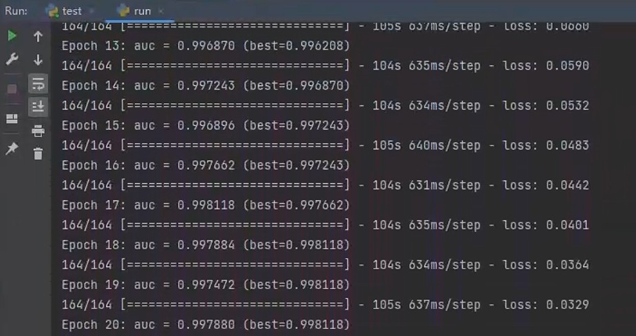

## DGA（Domain Generation Algorithms）预测

采用LSTM模型，训练一个能够识别正常域名和DGA域名的分类器。实现了 TensorFlow 和 Pytorch 两个版本，支持从 MySQL 中加载测试数据。

数据集：`tensorflow/data/data.csv` & `pytorch/data/data.csv`

正常域名：`1000000`, DGA域名：`2723778`

### 1. TensorFlow 版本

#### 环境依赖
`pip install -r tensorflow/requirements.txt`
#### 训练
`python tensorflow/train.py`

#### 测试
`python tensorflow/test.py`

### 2. PyTorch 版本
#### 环境依赖
`pip install -r pytorch/requirements.txt`
#### 训练
`python pytorch/train.py`
#### 测试
`python pytorch/test.py`

### 3. DGA 数据生成
项目集成了 39 种 DGA 算法，来源：[baderj/domain_generation_algorithms](https://github.com/baderj/domain_generation_algorithms)

`python dga_gengeators/data.py`

